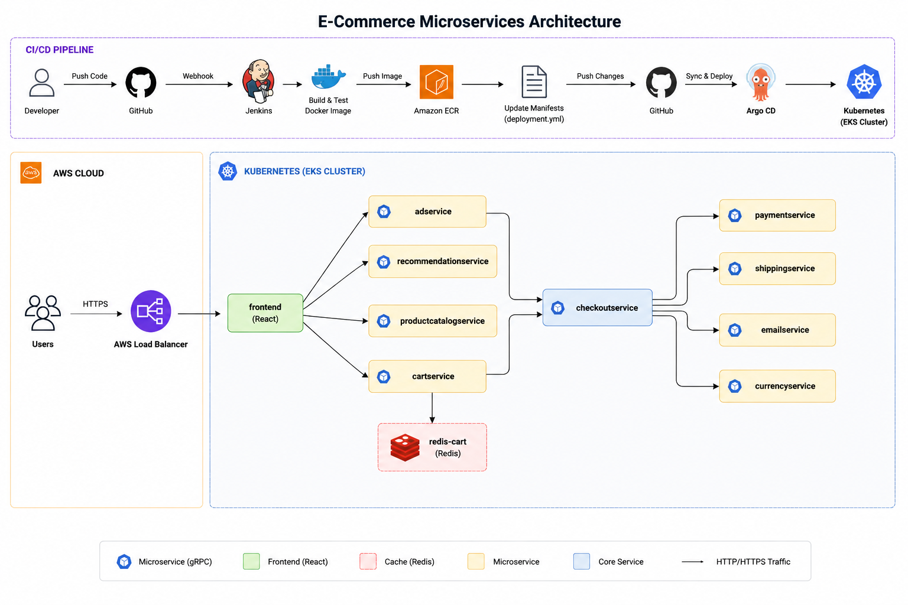
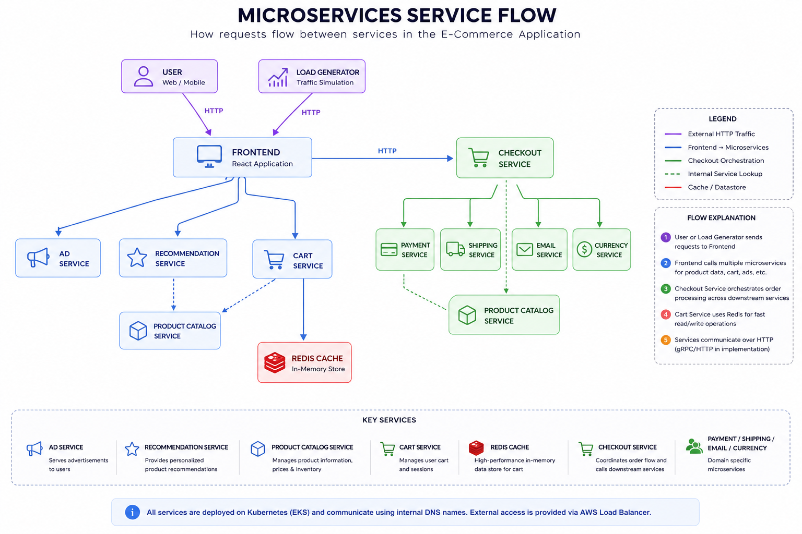
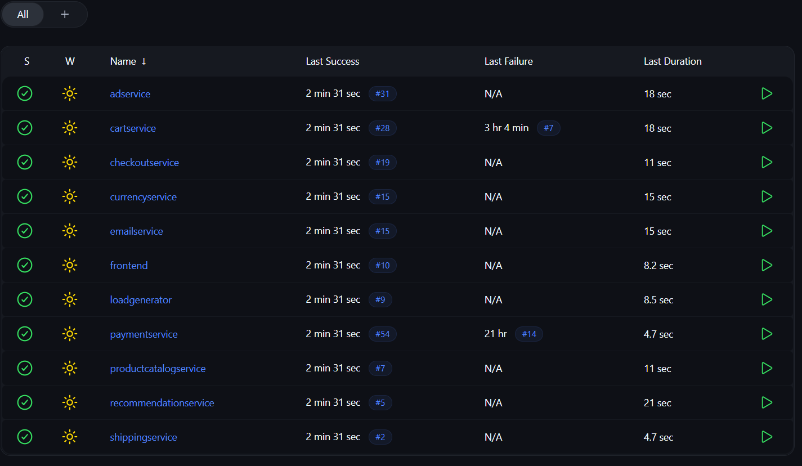
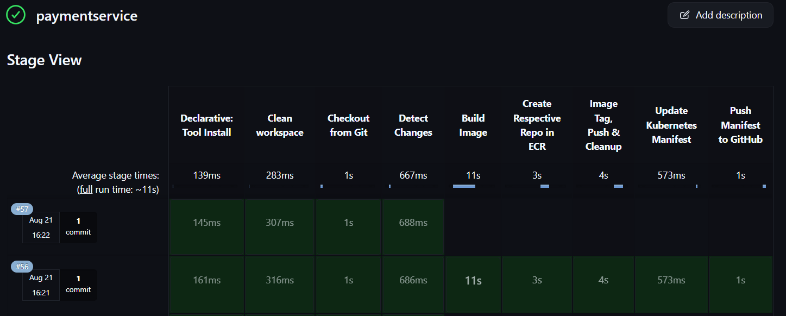

# 11-Microservices E-Commerce Application

A containerized **11-microservice e-commerce application** deployed on
**AWS EKS** with a complete **CI/CD and GitOps workflow** using **Jenkins**,
**Amazon ECR**, **Kubernetes**, and **Argo CD**.

## 🚀 Project Overview

This project demonstrates how a microservices application can be built,
containerized, continuously integrated, and automatically deployed to
Kubernetes.

The application consists of multiple independent services that
communicate with each other through Kubernetes Services.

## 🏗️ Architecture



## 🔄 Application Service Flow

The main request flow is:



## ☁️ Infrastructure

The application runs on:

-   **AWS EKS** --- Kubernetes cluster
-   **Kubernetes** --- container orchestration
-   **Amazon ECR** --- Docker image registry
-   **AWS Load Balancer** --- external application access
-   **Jenkins** --- CI/CD Pipeline for each service
-   **Argo CD** --- GitOps continuous delivery

## 🔧 CI/CD Pipeline

The project uses Jenkins for continuous integration and Argo CD for
continuous deployment.

``` text
Developer
    │
    ▼
  GitHub
    │
    │ Webhook
    ▼
 Jenkins
    │
    ├── Detect changed service
    │
    ├── Build Docker image
    │
    ├── Push image to Amazon ECR
    │
    └── Update Kubernetes deployment.yml
             │
             ▼
          GitHub
             │
             │ GitOps
             ▼
          Argo CD
             │
             ▼
        AWS EKS Cluster
             │
             ▼
       Kubernetes Pods
```

### Intelligent Change Detection

- Each service has its own `Jenkinsfile`.
- Jenkins checks the Git commit changes before building.
- Does application code change ?? If Yes then New Image is Built further pushed to ECR. If No, Skip Build.
- **This prevents every microservice pipeline from rebuilding when an unrelated service changes.**
- **It also prevents an infinite webhook loop when Jenkins updates only the Kubernetes manifest:**

**Jenkins Pipelines**


**Payment Service Pipeline Example**



## 📁 Repository Structure

``` text
11-Microservices-/
│
├── frontend/
│   ├── manifest/
│   │   ├── deployment.yml
│   │   ├── service.yml
│   │   └── service-external.yml
│   ├── Dockerfile
│   └── Jenkinsfile
│
├── paymentservice/
│   ├── manifest/
│   │   ├── deployment.yml
│   │   └── service.yml
│   ├── Dockerfile
│   └── Jenkinsfile
│
├── productcatalogservice/
├── cartservice/
├── currencyservice/
├── shippingservice/
├── adservice/
├── recommendationservice/
├── checkoutservice/
├── emailservice/
├── loadgenerator/
│
└── README.md
```

Each microservice contains its application code, Dockerfile, Jenkins
pipeline, and Kubernetes manifests.

## 🐳 Containerization

Each application service is packaged as a Docker image.

Example:

``` bash
docker build -t paymentservice:1 ./paymentservice
```

Images are pushed to Amazon ECR:

``` text
AWS Account
   │
   ▼
Amazon ECR
   ├── paymentservice
   ├── frontend
   ├── cartservice
   ├── currencyservice
   └── ...
```

## ☸️ Kubernetes

Each microservice is deployed using Kubernetes `Deployment` and
`Service` resources.

Internal services use:

``` yaml
type: ClusterIP
```

The frontend is exposed externally through:

``` yaml
type: LoadBalancer
```

Kubernetes DNS allows services to communicate using names such as:

``` text
productcatalogservice:3550
currencyservice:7000
cartservice:7070
checkoutservice:5050
```

## 🔁 GitOps with Argo CD

Argo CD continuously monitors the Kubernetes manifests stored in GitHub.

When Jenkins updates the image tag:

``` yaml
image: <ECR-REPOSITORY>:<BUILD_NUMBER>
```

Argo CD detects the Git change and synchronizes the desired state with
the EKS cluster.

``` text
GitHub
   │
   │ desired state
   ▼
Argo CD
   │
   │ sync
   ▼
Kubernetes
```

## 🛠️ Technologies Used

  Category                   Technologies
  -------------------------- -------------------------
  Cloud                      AWS
  Containerization           Docker
  Orchestration              Kubernetes / Amazon EKS
  CI                         Jenkins
  CD / GitOps                Argo CD
  Container Registry         Amazon ECR
  Version Control            Git / GitHub
  Service Discovery          Kubernetes DNS
  External Access            AWS Load Balancer
  Cache                      Redis
  Application Architecture   Microservices

## 🎯 Key DevOps Concepts Demonstrated

-   Microservices architecture
-   Docker containerization
-   Kubernetes Deployments and Services
-   Kubernetes health probes
-   ClusterIP and LoadBalancer Services
-   Kubernetes service discovery
-   AWS EKS deployment
-   Amazon ECR image management
-   Jenkins CI pipelines
-   GitHub webhooks
-   Git-based change detection
-   Automated Docker image builds
-   GitOps with Argo CD
-   Automated Kubernetes manifest updates
-   Continuous deployment
-   Preventing CI/CD webhook loops

## 📌 Project Outcome

The complete application is deployed on AWS EKS and accessible through
an AWS Load Balancer.

The workflow from **code change → Docker image → ECR → GitHub manifest
update → Argo CD → Kubernetes deployment** is automated.
